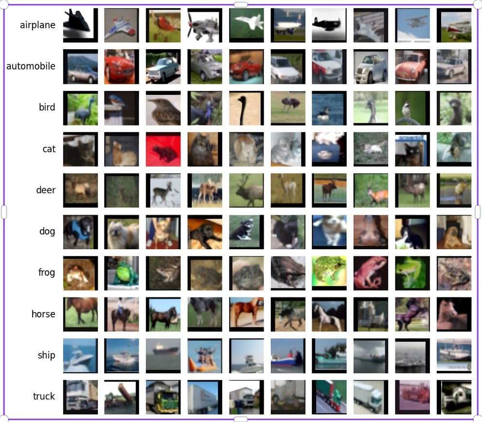
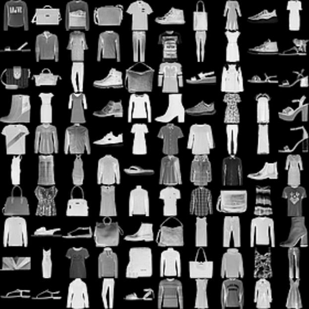
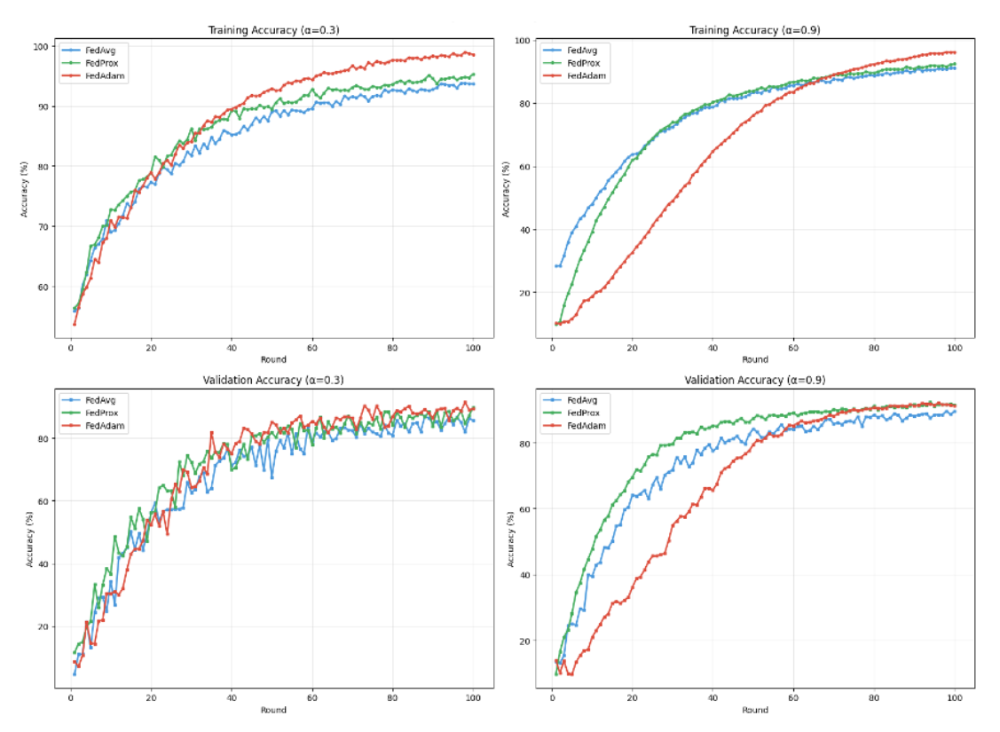
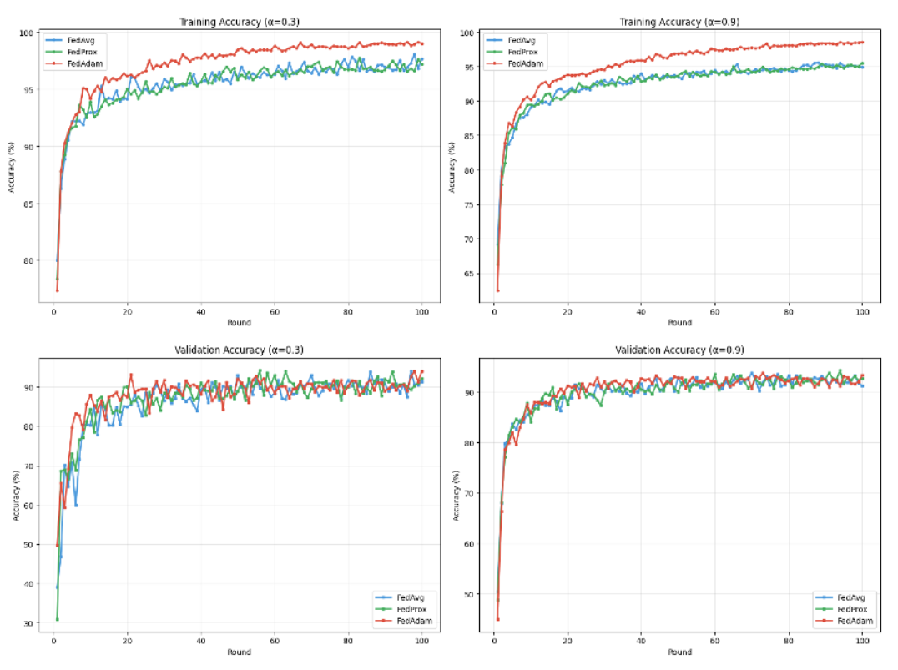
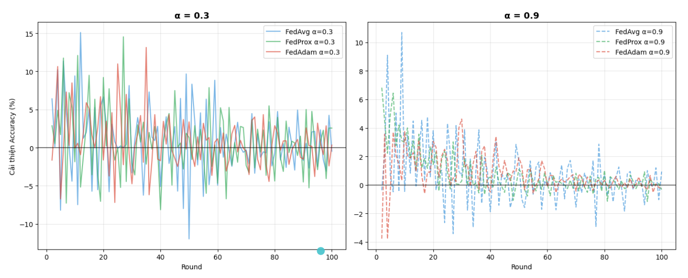
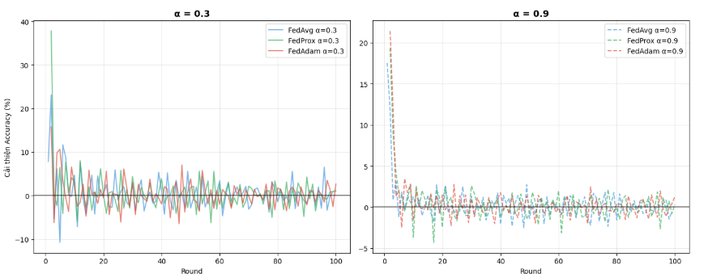

# Federated Learning Benchmark (FedAvg vs FedProx vs FedAdam)

[](https://python.org)
[](https://pytorch.org)
[](https://flower.dev)

A reproducible benchmark comparing **FedAvg**, **FedProx**, and **FedAdam** on **CIFAR-10** and **Fashion-MNIST** under **non-IID client data** (Dirichlet split with **$$\( \alpha \in \{0.3, 0.9\}\)$$.**

This repository contains experiment notebooks, result artifacts and a full report in PDF.

## Project context

This benchmark was developed as part of an undergraduate thesis project focused on:

- Comparing convergence and final performance across algorithms
- Measuring the impact of non-IID data (varying $$\( \alpha \)$$)
- Analyzing training time and communication-related trade-offs
- Tuning hyperparameters (notably for FedAdam)

## Highlights

- **Algorithms**: FedAvg, FedProx, FedAdam
- **Datasets**: CIFAR-10, Fashion-MNIST
- **Non-IID**: Dirichlet partition with \( $$\alpha = 0.3 \$$) (more heterogeneous) and \( $$\alpha = 0.9 \$$) (less heterogeneous)
- **Framework**: Flower (`flwr`) + PyTorch
- **Typical experimental setup**:
  - 10 clients
  - 100 communication rounds

## Datasets (quick look)

<div align="center">

| Dataset | Classes | Samples | Image size |
|---|---:|---:|---|
| CIFAR-10 | 10 | 60,000 | 32×32×3 |
| Fashion-MNIST | 10 | 70,000 | 28×28×1 |

</div>

<p align="center">
  
  
</p>

## Results (visual overview)

### Summary table

The following table aggregates the final validation accuracy, the average validation accuracy over the last 20 rounds, and total training time.

<div align="center">

| Dataset        | α   | Algorithm | Final val acc (%) | Mean val acc (last 20 rounds) (%) | Total time (min) |
|---------------|-----|-----------|--------------------|------------------------------------|------------------|
| Fashion-MNIST | 0.3 | FedAvg    | 91.33              | 90.58                              | 6048             |
| Fashion-MNIST | 0.3 | FedProx   | 92.11              | 90.55                              | 9979             |
| Fashion-MNIST | 0.3 | FedAdam   | **93.99**          | **90.68**                          | 6309             |
| Fashion-MNIST | 0.9 | FedAvg    | 91.24              | 92.33                              | 6478             |
| Fashion-MNIST | 0.9 | FedProx   | 92.66              | **92.49**                          | 9468             |
| Fashion-MNIST | 0.9 | FedAdam   | **93.32**          | 92.22                              | **6129**         |
| CIFAR-10      | 0.3 | FedAvg    | 85.71              | 84.74                              | **10099**        |
| CIFAR-10      | 0.3 | FedProx   | **89.79**          | 86.87                              | 12671            |
| CIFAR-10      | 0.3 | FedAdam   | 89.38              | **88.74**                          | 10585            |
| CIFAR-10      | 0.9 | FedAvg    | 89.56              | 88.29                              | **10401**        |
| CIFAR-10      | 0.9 | FedProx   | **91.46**          | 91.26                          | 13038            |
| CIFAR-10      | 0.9 | FedAdam   | 91.24              | **91.36**                              | 10589            |

</div>

### Accuracy vs. round (training and validation)

<div align="center">

  <table>
    <tr>
      <td align="center">
        
        <br />
        <strong>CIFAR-10</strong>
      </td>
      <td align="center">
        
        <br />
        <strong>Fashion-MNIST</strong>
      </td>
    </tr>
  </table>

</div>

### Convergence trend (per-round change)

These plots show the per-round accuracy change for \( $$\alpha = 0.3 \$$) and \( $$\alpha = 0.9 \$$).

<div align="center">

  <p>
    
    <br />
    <strong>CIFAR-10</strong>
  </p>

  <p>
    
    <br />
    <strong>Fashion-MNIST</strong>
  </p>

</div>

## Method overview

### Algorithms

1. **FedAvg**: the baseline federated averaging method
2. **FedProx**: adds a proximal term to improve robustness under heterogeneity
3. **FedAdam**: adaptive optimization at the server (federated Adam)

### Non-IID partitioning

Clients receive data via a Dirichlet distribution with concentration parameter $$\( \alpha \)$$:

- $$\( \alpha = 0.3 \)$$: more skewed (more heterogeneous clients)
- $$\( \alpha = 0.9 \)$$: less skewed (more homogeneous clients)

### Metrics

- **Validation accuracy**
- **Convergence speed** (rounds needed to reach a target regime)
- **Training time** (wall-clock time)
- (Optionally) communication-related quantities depending on the notebook

### FedAdam tuning (reference)

The report and grid-search artifacts include a tuned configuration for FedAdam. A representative set of parameters used in the experiments:

- Learning rate: `0.01`
- Beta1: `0.9`
- Beta2: `0.999`
- Epsilon: `1e-8`

## Experimental setup (more details)

### Federated configuration

- **Number of clients**: 10 participating clients
- **Client participation**: all clients participate in every round (full participation)
- **Rounds**: 100 communication rounds
- **Local training**:
  - Local optimizer: SGD or Adam (depending on notebook)
  - Local epochs per round: typically 1–5 (see each notebook for the exact value)
  - Batch size: commonly 32 or 64

### Models

While the exact architectures are defined inside the notebooks, the general choices are:

- **CIFAR-10**: a convolutional network (Conv2D + pooling + fully connected layers)
- **Fashion-MNIST**: a lighter CNN suitable for 28×28 grayscale images

### Hardware & runtime notes

- Designed to run on a single machine with a GPU, but CPUs also work (with longer training time).
- Training time in the summary table is measured end-to-end for the full 100 rounds.

## Reproducing experiments

Each family of experiments is encapsulated in its own notebook and writes results to a corresponding folder.

### CIFAR-10

- **Main notebooks** (examples):
  - `Fed_CIFAR10/CIFAR10_FedAvg.ipynb`
  - `Fed_CIFAR10/CIFAR10_FedProx.ipynb`
  - `Fed_CIFAR10/CIFAR10_FedAdam.ipynb`
- **Outputs**:
  - `Fed_CIFAR10/alpha_03/` – non-IID with $$\( \alpha = 0.3 \)$$
  - `Fed_CIFAR10/alpha_09/` – non-IID with $$\( \alpha = 0.9 \)$$

### Fashion-MNIST

- **Main notebooks** (examples):
  - `Fed_FMNIST/FMNIST_FedAvg.ipynb`
  - `Fed_FMNIST/FMNIST_FedProx.ipynb`
  - `Fed_FMNIST/FMNIST_FedAdam.ipynb`
- **Outputs**:
  - `Fed_FMNIST/alpha_03/`
  - `Fed_FMNIST/alpha_09/`

### Hyperparameter search

- **FedAdam**:
  - Notebooks: `GridSearch/FedAdam/GridSearch_Time_Adam_CLIENT.ipynb`, `GridSearch/FedAdam/GridSearch_Time_Adam_SERVER.ipynb`, and comparison notebooks in the same folder
  - Results: `GridSearch/FedAdam/fl_gridsearch_final_results/` and `GridSearch/FedAdam/fl_results_gs_cl/`
- **FedProx**:
  - Notebook: `GridSearch/FedProx/prox-fl-pretrain-noniid-pageper.ipynb`
  - Results: artifacts written under `GridSearch/FedProx/`

For exact hyperparameters, please refer directly to the corresponding notebook cells (learning rates, proximal coefficients, momentum parameters, schedulers, etc.).

## Setup

### Install dependencies

```bash
python -m pip install -r requirements.txt
```

### Run notebooks

Start Jupyter and open any of the experiment notebooks:

```bash
jupyter notebook Fed_CIFAR10/CIFAR10_FedAvg.ipynb
jupyter notebook Fed_CIFAR10/CIFAR10_FedProx.ipynb
jupyter notebook Fed_CIFAR10/CIFAR10_FedAdam.ipynb

# or for Fashion-MNIST
jupyter notebook Fed_FMNIST/FMNIST_FedAvg.ipynb
```

## Repository contents

```
.
├── Fed_CIFAR10/
│   ├── CIFAR10_FedAvg.ipynb          # CIFAR-10 FedAvg experiment
│   ├── CIFAR10_FedProx.ipynb         # CIFAR-10 FedProx experiment
│   ├── CIFAR10_FedAdam.ipynb         # CIFAR-10 FedAdam experiment
│   ├── cifar10_compaire_result.ipynb # Aggregated CIFAR-10 analysis
│   ├── alpha_03/                     # CIFAR-10 results for α = 0.3
│   └── alpha_09/                     # CIFAR-10 results for α = 0.9
├── Fed_FMNIST/
│   ├── FMNIST_FedAvg.ipynb           # Fashion-MNIST FedAvg experiment
│   ├── FMNIST_FedProx.ipynb          # Fashion-MNIST FedProx experiment
│   ├── FMNIST_FedAdam.ipynb          # Fashion-MNIST FedAdam experiment
│   ├── fmnist_compaire_result.ipynb  # Aggregated Fashion-MNIST analysis
│   ├── alpha_03/                     # Fashion-MNIST results for α = 0.3
│   └── alpha_09/                     # Fashion-MNIST results for α = 0.9
├── GridSearch/
│   ├── FedAdam/
│   │   ├── GridSearch_Time_Adam_CLIENT.ipynb
│   │   ├── GridSearch_Time_Adam_SERVER.ipynb
│   │   ├── compaire_girdsearch_adam.ipynb
│   │   ├── compaire_girdsearch_adam_etal.ipynb
│   │   ├── fl_gridsearch_final_results/  # Aggregated FedAdam grid-search results
│   │   └── fl_results_gs_cl/             # Client-level FedAdam search logs
│   └── FedProx/
│       └── prox-fl-pretrain-noniid-pageper.ipynb
├── Imgs/                             # All figures used in the README and report
├── Paper-Research/                   # Reference papers (PDFs) grouped by algorithm
├── requirements.txt                  # Python dependencies
├── Report_FL_Compare.pdf             # Full thesis/report in PDF
└── .gitignore
```

## Report

- **Full PDF**: [`FL_Benchmark_Report`](FL_Benchmark_Report.pdf)

## Authors & acknowledgement

**Maintainer (GitHub repo owner)**:
-  [Desuuy](https://github.com/Desuuy)
-  [LuongDat9999](https://github.com/LuongDat9999)

**Special thanks to advisors/instructors and the Flower + PyTorch communities.**

## Citation

If you use this benchmark in a project or report, please cite the original papers:

- [McMahan et al., *Communication-efficient learning of deep networks from decentralized data*, AISTATS 2017. (FedAvg)](https://arxiv.org/abs/1602.05629)
- [Li et al., *Federated optimization in heterogeneous networks*, MLSys 2020. (FedProx)](https://arxiv.org/abs/1812.06127)
- [Reddi et al., *Adaptive federated optimization*, ICLR 2021. (FedAdam)](https://arxiv.org/abs/2003.00295)
